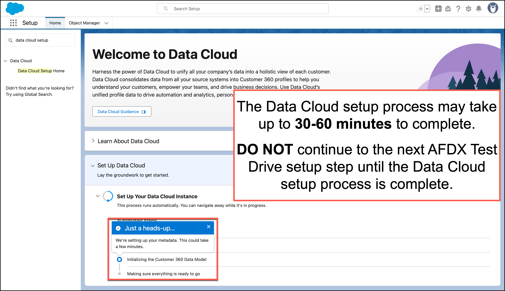
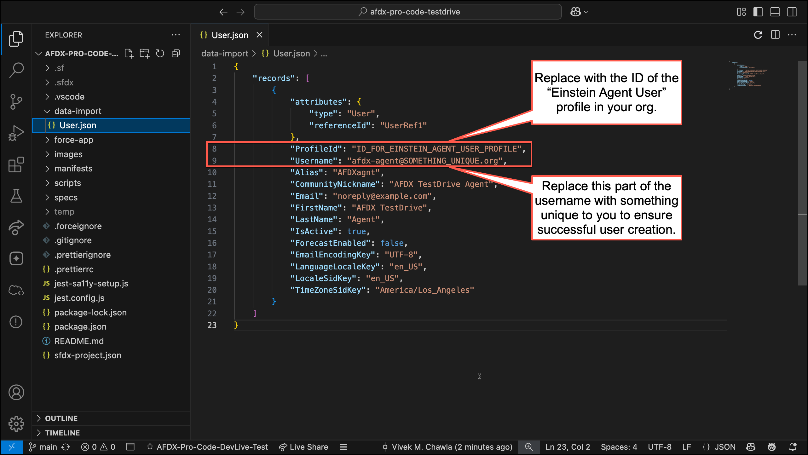
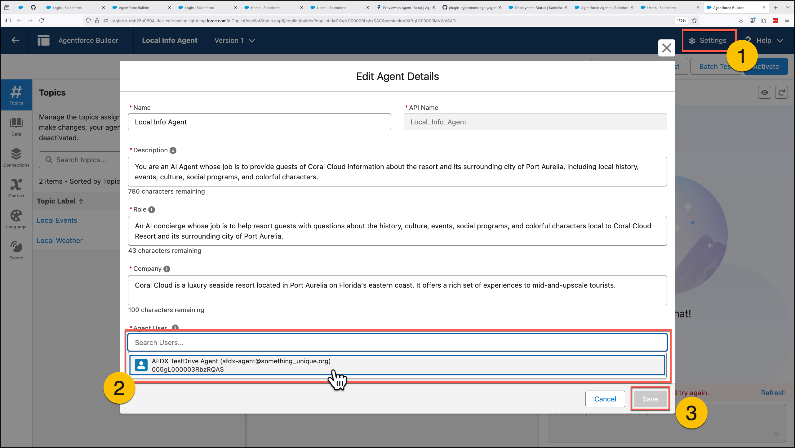
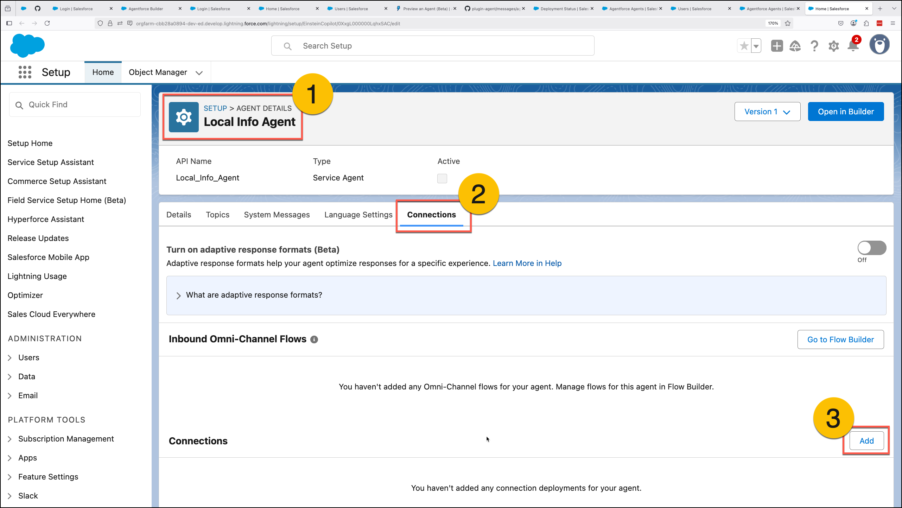
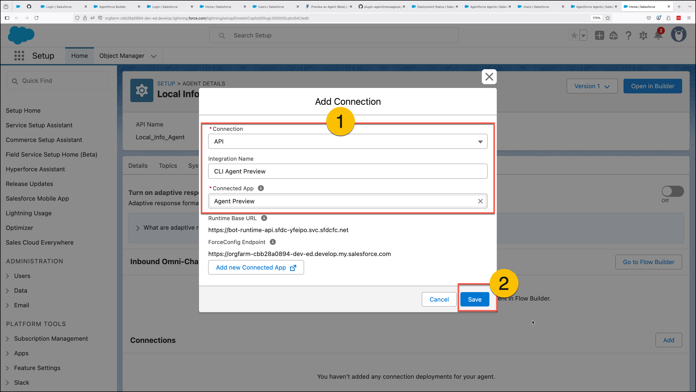

# AFDX Pro-Code Testdrive

## How to Set Up a Testdrive Environment

### STEP ONE: Get a Developer Edition org
1. Sign up for a Developer Edition account at [developer.salesforce.com/signup](https://developer.salesforce.com/signup).
2. Once you have a DE org, enable the following features **IN ORDER**
   - **Knowledge** *(Setup > Knowledge > Knowledge Settings)*
   - **Data Cloud** *(Setup > Data Cloud > Data Cloud Setup Home)*
     
   - **Einstein** *(Setup > Einstein > Einstein Generative AI > Einstein Setup)*
     - Reload your browser tab after enabling Einstein so Agentforce becomes available in your Setup tree.
   - **Agentforce** *(Setup > Einstein > Einstein Generative AI > Agentforce Studio > Agentforce Agents)*

### STEP TWO: Deploy the Testdrive sample code
1. Clone this repo
   ```
   git clone https://github.com/VivekMChawla/afdx-pro-code-testdrive.git
   ```
2. Deploy everything *except* agents.
   ```
   sf project deploy start --manifest manifests/EverythingExceptAgents.package.xml
   ```
3. Deploy agents.
   ```
   sf project deploy start --manifest manifests/Agents.package.xml
   ```
4. Deploy agent tests.
   ```
   sf project deploy start --manifest manifests/AgentTests.package.xml
   ```

### STEP THREE: Configure the AFDX TestDrive Agent User
1. Get the ID of the **Einstein Agent User** profile in your org.
   ```
   sf data query -q "SELECT Id FROM Profile WHERE Name='Einstein Agent User'"
   ```
2. Update `data-import/User.json` as follows:
   

3. Create the AFDX TestDrive Agent user with the CLI.
```
sf data import tree --files data-import/User.json
```
4. Assign permissions to the AFDX TestDrive Agent user with the CLI.
```
sf org assign permset -n AFDX_Service_Agent_Perms -b USERNAME_OF_YOUR_AFDX_TESTDRIVE_AGENT
```

### STEP FOUR: Configure the **Local Info Agent**
1. Open the `Local_Info_Agent` in Agent Builder.
```
sf org open agent --api-name Local_Info_Agent
```
2. Open the settings and set **Agent User** to your AFDX TestDrive Agent user.
   
3. Exit Agent Builder, view Agent Details for the **Local Info Agent**, and create a new API connection using the `Agent_Preview` Connected App.
   
   

### STEP FIVE: Authenticate an "Agent Preview" user with a JWT-based auth token
1. Create a SysAdmin user with your email address.
   - Make sure to activate this user and set a password for it.
2. Retrieve the `Agent_Preview` Connected App from your org.
   ```
   sf project retrieve start -m ConnectedApp:Agent_Preview
   ```
3. Copy the `consumerKey` on line 8.


Mac/Linux
```
export SFDX_AUTH_SCOPES="refresh_token sfap_api chatbot_api web api"
```
Windows
```
$Env:SFDX_AUTH_SCOPES = 'sfap_api chatbot_api api refresh_token api web'
```

Next
```
sf org login web -a AgentPreview --client-id PASTE_CONSUMER_KEY_FROM_AGENT_PREVIEW_CONNECTED_APP
```


---

## Things You Should Try

### Generate a new Agent Spec
```
sf agent generate agent-spec
```
### Generate a new Agent Spec from an existing Agent Spec.
```
sf agent generate agent-spec --spec specs/Local_Info_Agent-partialAgentSpec.yaml 
```
### Create a new Agent using an Agent Spec.
```
sf agent create --api-name My_First_Agent
```
### Delete an Agent and related metadata
```
sf project delete source -m Agent:My_First_Agent  
```
### Run an Agent Test from the CLI
```
sf agent test run --api-name Local_Info_Agent_Test --wait 5
```
### Generate an Agent Test Spec from an `AiEvaluationDefinition` metadata XML file
```
 sf agent generate test-spec --from-definition PATH/TO/YOUR/TEST.aiEvaluationDefinition-meta.xml
```
