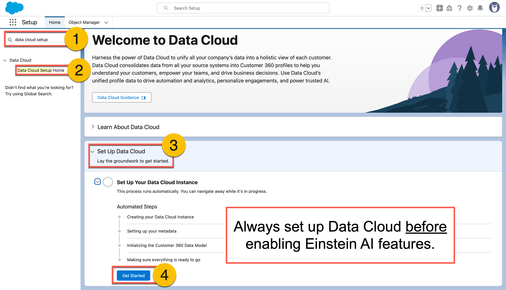
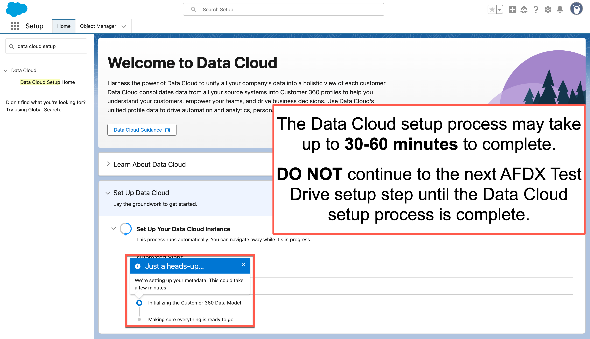

# AFDX Pro-Code Testdrive

## How to Set Up a Testdrive Environment

### STEP ONE: Get a Developer Edition org
1. Sign up for a Developer Edition account at [developer.salesforce.com/signup](https://developer.salesforce.com/signup).
2. Once you have a DE org, enable the following features **IN ORDER**
   - **Knowledge** *(Setup > Knowledge > Knowledge Settings)*
   - **Data Cloud** *(Setup > Data Cloud > Data Cloud Setup Home)*
     - 
     - 
     - This can take up to 30 minutes to complete
     - DO NOT proceed until the setup process is finished
   - **Einstein** *(Setup > Einstein > Einstein Generative AI > Einstein Setup)*
     - Reload your browser tab after enabling Einstein so Agentforce becomes available in your Setup tree.
   - **Agentforce** *(Setup > Einstein > Einstein Generative AI > Agentforce Studio > Agentforce Agents)*

### STEP TWO: Deploy the Testdrive sample code
1. Clone this repo
   ```
   git clone https://github.com/VivekMChawla/afdx-pro-code-testdrive.git
   ```
2. Deploy everything *except* agents.
   ```
   sf project deploy start --manifest manifests/EverythingExceptAgents.package.xml
   ```
3. Deploy agents.
   ```
   sf project deploy start --manifest manifests/Agents.package.xml
   ```
4. Deploy agent tests.
   ```
   sf project deploy start --manifest manifests/AgentTests.package.xml
   ```

### STEP THREE: Configure the Agent User for the Local Info Agent
1. Use the Agent Builder to assign an agent user.

-- MORE STEPS TO ADD -- 

---

## Things You Should Try

### Generate a new Agent Spec
```
sf agent generate agent-spec
```
### Generate a new Agent Spec from an existing Agent Spec.
```
sf agent generate agent-spec --spec specs/Local_Info_Agent-partialAgentSpec.yaml 
```
### Create a new Agent using an Agent Spec.
```
sf agent create --api-name My_First_Agent
```
### Delete an Agent and related metadata
```
sf project delete source -m Agent:My_First_Agent  
```
### Run an Agent Test from the CLI
```
sf agent test run --api-name Local_Info_Agent_Test --wait 5
```
### Generate an Agent Test Spec from an `AiEvaluationDefinition` metadata XML file
```
 sf agent generate test-spec --from-definition PATH/TO/YOUR/TEST.aiEvaluationDefinition-meta.xml
```
